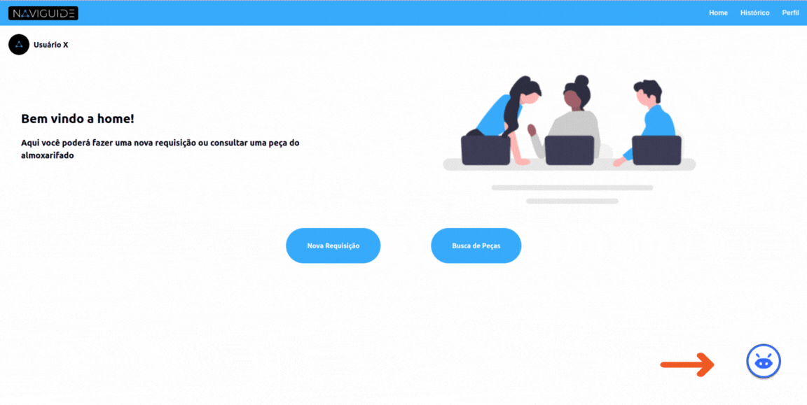
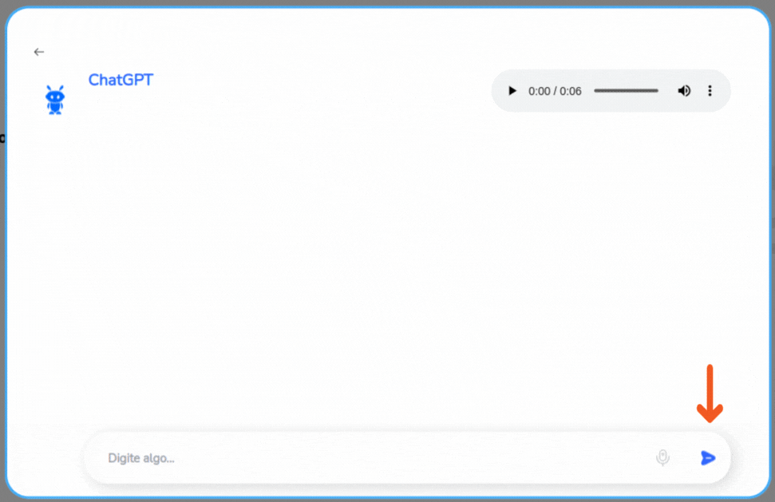
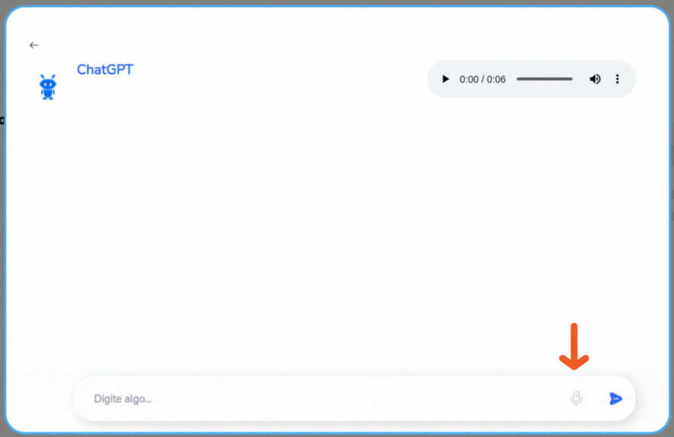
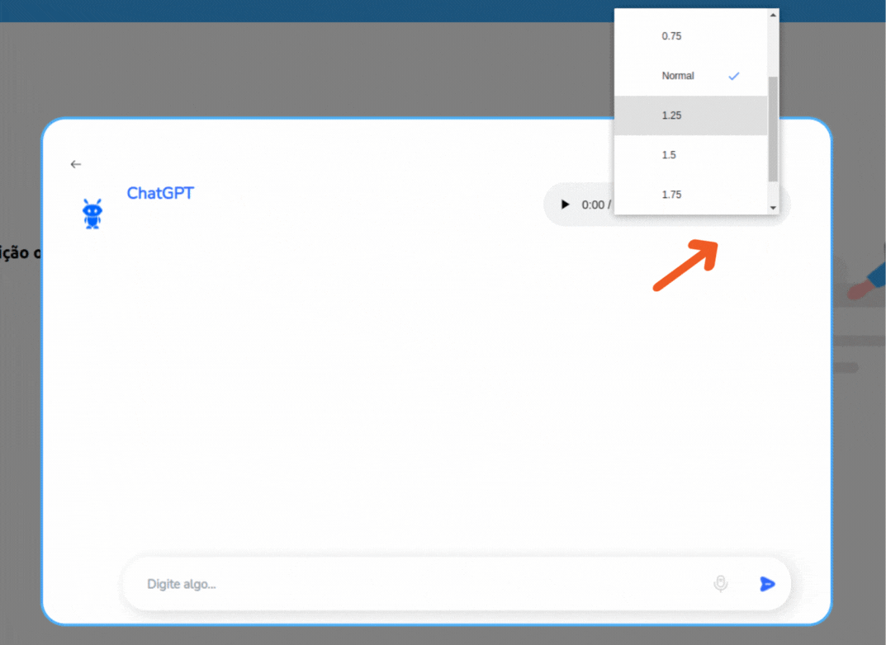
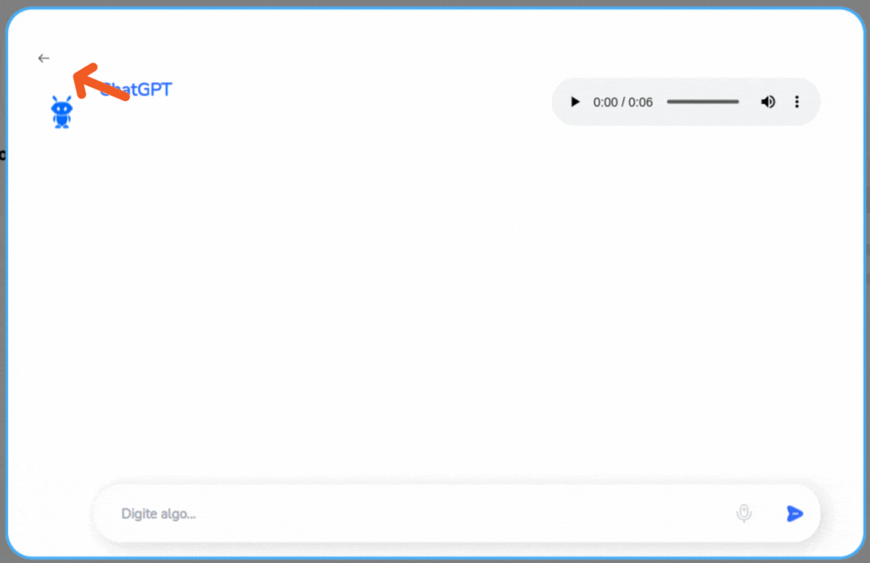

# Desenvolvimento de interface TTS e GUI e Design Assistivo.

## Design de Interface Gráfica.

O chatbot foi desenvolvido para oferecer uma experiência de atendimento interativa, utilizando tecnologia de Text to Speech (TTS), que é uma tecnologia que converte texto escrito em fala. Essa tecnologia é frequentemente utilizada para ajudar pessoas com deficiências visuais a acessar conteúdo digital ou àqueles com dificuldades de leitura, além de ser útil em várias outras aplicações, como sistemas de navegação por GPS, assistentes virtuais e leitores de e-books, por exemplo. O processo geralmente envolve duas etapas principais para facilitar o acesso a informações e serviços, que é a conversão de texto em linguagem falada e a síntese de fala. 

A interface foi projetada com um foco em simplicidade e clareza. Os elementos de interface são autoexplicativos, com ícones familiares, como, por exemplo, o envio de uma mensagem representada por uma seta azul dentro do espaço de texto e de um ícone de um microfone ao lado, representando local de gravação de  voz, sem contar um layout que imita conversas naturais. Dessa maneira, os usuários podem interagir com o chatbot digitando ou usando o reconhecimento de voz, e as respostas são fornecidas tanto em texto quanto em áudio, o qual está localizado dentro do modal na parte superior à direita da tela. Cada som emitido é uma mensagem que foi escrita e enviada para solicitação.

Além disso, o layout é limpo e sem distrações, usando ícones e cores diretas, com um esquema que minimiza a fadiga visual e maximiza o contraste para legibilidade, usando tons frios, calmos e neutros que reduzem a tensão ocular, como a cor azul celeste e a cor branca, como principais inclusão até mesmo para pessoas com daltonismo, por exemplo. Além do mais, existem elementos interativos, como botões grandes e espaçosos. Esses, inclusive a página de entrada para o modal, é botão grande no canto inferior direito da tela com robô, além de botões de envios de mensagens, esquema de tipografia do bate-papo que foi usado com a fonte “Nunito Bold”. De maneira, assim, adequado a evitar cliques acidentais, ainda mais para o uso de dispositivos desktops e tablets.

*Botão para iniciar o chatbot*

*Botão de para o clique de envio*

## Usabilidade e Acessibilidade.

O design assistivo inclui uma interface de recurso de acessibilidade, como legendas para áudios e a capacidade de controlar a reprodução de áudio na velocidade correta para que diferentes e todos usuários possam interagir com o chatbot de maneira eficaz. Além do mais, vale ressaltar que, a atenção foi dada especialmente para garantir que a interface seja acessível para usuários com uma variedade de necessidades, incluindo aqueles que dependem de tecnologias assistivas como leitores de tela, até mesmo usuários com pouca familiaridade com a tecnologia. Logo, o fluxo de navegação foi projetado para ser intuitivo, com uma estrutura clara que guia o usuário através do processo de interação com o chatbot, desde a iniciação até a conclusão das tarefas desejadas.

Vale ressaltar também que a interface do chatbot foi cuidadosamente projetada para estar em conformidade com as Diretrizes de Acessibilidade para Conteúdo Web (WCAG) 2.0, do nível AA. E isso garante que o conteúdo seja mais amplo para usuários com deficiências, incluindo, mas não limitando a, deficiências visuais, auditivas, físicas, de fala, cognitivas e neurológicas. Então, foi analisado e depois projetado com as principais áreas dessa conformidade, como, por exemplo:

1.  **Perceptibilidade**: A interface oferece alternativas de texto para conteúdo não textual e torna mais fácil para os usuários verem e ouvirem o conteúdo, incluindo a separação entre o primeiro plano e o fundo.

2. **Operabilidade**: A funcionalidade da interface pode ser operada através de uma variedade de dispositivos de entrada, não se limitando apenas a gestos de toque ou uso de um mouse no botão de envio do espaço de envio.

3. **Compreensibilidade**: As informações e a operação da interface são compreensíveis, com textos claros, cores frias e neutras - como foi dito anteriormente - e previsibilidade das operações.

4. **Robusto**: O conteúdo é suficientemente robusto para ser interpretado de forma confiável por uma ampla variedade de agentes de usuário, incluindo tecnologias assistivas.

## Recursos Assistivos.

Vale lembrar que na interface  existem alternativas de entradas que inclui, por exemplo, a funcionalidade de reconhecimento de voz como uma alternativa de entrada, permitindo aos usuários interagir com o chatbot sem a necessidade de digitação. Esta função foi rigorosamente testada para assegurar a precisão na captura de comandos de voz e conversão em texto. Já para saída de áudio, as respostas do chatbot são fornecidas não só em forma de texto no esquema de bate-papo, mas também em áudio, usando uma síntese de fala avançada que soa natural e é fácil de entender. Os controles de áudio são facilmente acessíveis e podem ser operados com teclado ou assistentes de voz.

*Botão para acesso de gravação de voz para texto.*

## USABILIDADE POR PESSOAS COM DIVERSAS HABILIDADES!

Foi listado algumas usabilidade no que foi projetado, como, por exemplo:

1. **Acessibilidade Visual:** para usuários com deficiências visuais, a interface oferece contraste suficiente entre o texto e o fundo,  tem a opção de ampliar o texto sem perder funcionalidades e também a compatibilidade com leitores de tela e ampliadores de tela.
   
2. **Acessibilidade Auditiva:** nessa parte tem legendas ou transcrições para conteúdo de áudio e visualizações claras e leitura de texto que acompanham a saída de áudio, com mudanças de velocidade no botão dos três (3) pontinhos.

3. **Acessibilidade Motora:** aqui já tem a navegação completa por teclado e também a tolerância ao tempo, que é o suficiente para interações que não exigem movimentos rápidos.

4. **Acessibilidade Cognitiva:** nessa parte, há um design claro e consistente, e a capacidade de repetir e pausar a saída de áudio conforme necessário. Será implementado brevemente  uma instrução de passo a passo simples para a operação do chatbot.

## Eficiência da Conversão de Texto para Fala.

O sistema TTS do chatbot transforma o texto escrito em fala sintetizada com alta precisão e eficiência. Utilizando avançadas técnicas de processamento de linguagem natural (PLN), o sistema garante que o contexto e as nuances do texto sejam adequadamente capturados e reproduzidos na saída de áudio. Aliás, a voz sintetizada pelo sistema TTS é projetada para ser clara e facilmente compreensível. Testes extensivos foram realizados para assegurar que a pronúncia, entonação e ritmo estejam em harmonia com as expectativas dos usuários para uma comunicação natural e fluente, visto que irá para o setor industrial onde há máquinas operando.

Desse modo, os usuários têm a opção de personalizar a experiência de áudio ajustando a velocidade e o tom da voz sintetizada. Isso permite uma maior acessibilidade, especialmente para usuários que podem necessitar de mais tempo para processar informações auditivas ou que preferem um tom específico de voz.

*Alteração de velocidade para acompanhar a necessidade do usuário*

Em suma, o sistema TTS é projetado com uma interface de usuário que prioriza a facilidade de uso. Os comandos para ativar o TTS são simples e podem ser acessados diretamente no campo de entrada do chatbot ou através de comandos de voz. Além disso, a interface do TTS é acessível, seguindo as diretrizes de acessibilidade para garantir que todos os usuários, independentemente de habilidades ou deficiências, possam utilizar o sistema eficazmente. Sem contar que, portanto, esse sistema do chatbot foi desenvolvido para proporcionar uma experiência de áudio excepcional, com uma voz clara e compreensível, e opções personalizáveis para atender às necessidades de todos os usuários. Visto que o compromisso com a acessibilidade e a usabilidade é evidente em cada aspecto do design e funcionamento do sistema TTS. E, por fim, há um botão no canto superior da interface do modal à esquerda em orientação a saída do usuário da janela desse modal.

*Botão de voltar para interface principal*

## Testes.

Foram realizados testes de usabilidade tanto do grupo projetista quanto do usuário destinatário do projeto.  Percebeu-se que na versão atual da interface ocorreram alguns feedbacks dos usuários de aprimorar alguns pontos para ter uma melhor experiência de navegação, como, por exemplo, a harmonização do botão com ícone de um “bot” para iniciar a interface do chatbot (botão que fica no canto inferior direito na tela), visto que ficou pouco ainda imperceptível para os olhos do usuário/cliente e também na leitura do texto do áudio, nesse o feedback do usuário foi de colocar e selecionar a topografia para ser lida, caso ele queira voltar às mensagens anteriores, como de exemplos, aplicativos de comunicações de mensagens que são lidos vários áudios. Contudo, apesar do feedback dado pelo usuário, houve acertos de navegação por toda interface, inclusive a parte na parte do TTS, botões e ícones de envios.
